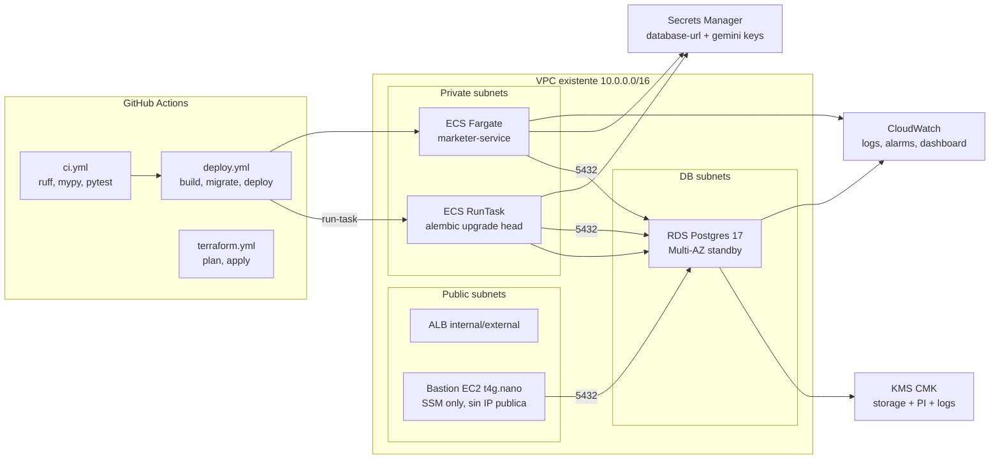
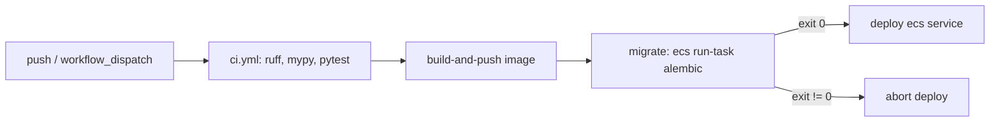
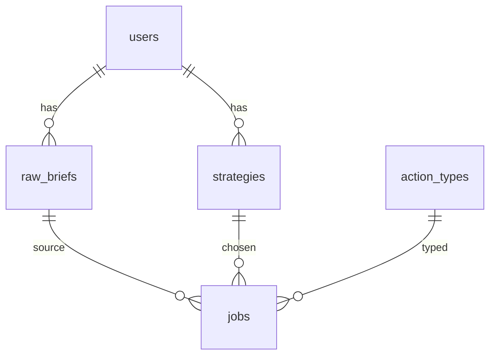

# 04 — AWS Deployment Architecture

**Version:** 3.0  
**Last Updated:** 2026-04-22  
**Target:** Production-grade, secure, highly available, cost-aware

---

## 1. Architecture Overview



---

## 2. Service Choices & Rationale

### 2.1 ECS Fargate

Fargate se mantiene como opción principal por simplicidad operativa y escalado automático. El servicio sigue siendo mayormente I/O-bound (espera de LLM), por eso se usan políticas híbridas en lugar de CPU-only.

### 2.2 ALB

ALB sigue siendo el frontend recomendado por integración nativa con ECS, health checks y métrica `ALBRequestCountPerTarget` para escalado basado en carga real.

### 2.3 VPC Endpoints + egress

Se priorizan endpoints privados para servicios AWS internos y salida controlada para dependencias externas.

### 2.4 Secrets Manager + KMS

Se centralizan secretos (`gemini`, tokens, `database-url`) y cifrado con CMKs dedicadas para RDS/PI/logs.

### 2.5 ECR

ECR continúa como registry principal.

### 2.6 RDS PostgreSQL Multi-AZ (nuevo)

| Opción | Costo | Operación | Fit |
|---|---:|---|---|
| **RDS PostgreSQL Multi-AZ** | Medio | Bajo | ✅ Recomendado |
| Aurora PostgreSQL | Alto | Medio | ⚠ Solo si se necesita escala superior |
| Self-managed EC2 | Bajo/medio | Alto | ❌ Mayor riesgo operacional |

Decisión:
- Prod: `db.t4g.small`, `multi_az=true`, `backup_retention_period=14`.
- Dev: `db.t4g.micro`, `multi_az=false`, `backup_retention_period=7`.
- `storage_type="gp3"` explícito para mejor costo/rendimiento.
- `rds.force_ssl=1`, `pgaudit`, `pg_stat_statements`.

### 2.7 Bastion vía SSM (nuevo)

El bastion se despliega sin IP pública, sin SSH abierto (`22` cerrado), con acceso exclusivo vía Session Manager.

Ventajas:
- Elimina exposición directa a Internet.
- Audita sesiones por CloudTrail/SSM.
- Habilita port-forward seguro a RDS (`5432`) para operaciones puntuales.

---

## 3. Network Architecture

### 3.1 VPC Layout

- Public subnets: ALB (y host bastion si aplica subnet pública sin IP pública).
- Private subnets: ECS service + migrator run-task.
- DB subnets: RDS.

### 3.2 Security Groups

**ALB (`sg-alb`)**
- Inbound: `443` (y opcional `80` redirect).
- Egress: `8080` a `sg-ecs`.

**ECS (`sg-ecs`)**
- Inbound: `8080` desde `sg-alb`.
- Egress: `443` a Internet/endpoints AWS.
- Egress: `5432` a `sg-rds`.

**RDS (`sg-rds`)**
- Inbound: `5432` desde `sg-ecs`.
- Inbound: `5432` desde `sg-bastion`.
- Sin ingress adicional.

**Bastion (`sg-bastion`)**
- Sin ingress.
- Egress `443` (SSM) y `5432` a `sg-rds`.

---

## 4. IAM Roles

### 4.1 ECS Task Execution Role

Incluye:
- ECR pull.
- `secretsmanager:GetSecretValue`.
- `kms:Decrypt` sobre CMK usada por `database-url`.
- CloudWatch logs.

### 4.2 ECS Task Role (service runtime)

Permisos mínimos de aplicación; sin acceso directo a secretos de DB.

### 4.3 Migrator Task Role (nuevo)

Rol separado del servicio para evitar overlap:
- `secretsmanager:GetSecretValue` sobre `marketer/{env}/database-url`.
- Logs del migrador (`/ecs/marketer-{env}-migrator`).

```json
{
  "Version": "2012-10-17",
  "Statement": [
    {
      "Effect": "Allow",
      "Action": ["secretsmanager:GetSecretValue"],
      "Resource": "arn:aws:secretsmanager:*:*:secret:marketer/*/database-url-*"
    },
    {
      "Effect": "Allow",
      "Action": ["logs:CreateLogStream", "logs:PutLogEvents"],
      "Resource": "arn:aws:logs:*:*:log-group:/ecs/marketer-*-migrator:*"
    }
  ]
}
```

### 4.4 Bastion Instance Role (nuevo)

Rol dedicado:
- `AmazonSSMManagedInstanceCore`.
- `secretsmanager:GetSecretValue` solo para `database-url`.

```json
{
  "Version": "2012-10-17",
  "Statement": [
    {
      "Effect": "Allow",
      "Action": ["secretsmanager:GetSecretValue"],
      "Resource": "arn:aws:secretsmanager:*:*:secret:marketer/*/database-url-*"
    }
  ]
}
```

---

## 5. Container Configuration

### 5.1 Service Task Definition

Nuevos puntos:
- Inyección de `DATABASE_URL` desde secret JSON key: `:url::`.
- Variables de pool:
  - `DB_POOL_SIZE`
  - `DB_POOL_MAX_OVERFLOW`
  - `DB_POOL_TIMEOUT_SECONDS`

### 5.2 Sizing

Se mantiene sizing base para servicio HTTP y se agrega task efímera de migración (`cpu=512`, `memory=1024`).

### 5.3 Migration Task Definition (nuevo)

Task definition dedicada (`marketer-{env}-migrator`) ejecutada por `ecs run-task`:
- `command = ["sh","-c","alembic upgrade head"]`
- `essential=true`
- Log group propio
- Sin `ecs_service` asociado (solo one-off run).

Flujo:
1. Build + push imagen.
2. `run-task` migrador con esa imagen.
3. Esperar `tasks-stopped`.
4. Validar `exitCode == 0`.
5. Si falla, no se despliega servicio.

---

## 6. Auto Scaling

### 6.1 Hybrid Strategy (nuevo)

Para carga I/O-bound se usa estrategia combinada:
- Target tracking CPU (70%).
- Target tracking Memory (75%).
- Target tracking `ALBRequestCountPerTarget` (primaria para throughput web).
- Step scaling por CPU burst (`>70/+1`, `>85/+2`, `>95/+3`).

Cooldowns:
- Scale out: `60s`
- Scale in: `300s`

### 6.2 Scaling Limits

| Environment | Min Tasks | Max Tasks |
|---|---:|---:|
| dev | 0 | 2 |
| prod | 2 | 10 |

### 6.3 Zero-downtime Deployment

- `deployment_minimum_healthy_percent = 100`
- `deployment_maximum_percent = 200`
- `deployment_circuit_breaker { enable=true, rollback=true }`

---

## 7. Deployment Pipeline (CI/CD)



Workflows:
- `ci.yml`: lint, typecheck, tests con Postgres y `alembic upgrade head`.
- `deploy.yml`: agrega job `migrate` entre build y deploy.
- `terraform.yml`: plan/apply infra.

---

## 8. Cost Model (updated)

### 8.1 Incremental Prod

- RDS `db.t4g.small` Multi-AZ: ~$50/mes
- gp3 20GB: ~$1.60/mes
- Enhanced monitoring + PI (7d): ~$0.50/mes
- Bastion `t4g.nano`: ~$3/mes
- EBS bastion gp3 10GB: ~$0.80/mes
- 2 CMKs: ~$2/mes

**Incremental prod estimado:** `~$61/mes`  
**Total prod estimado:** `~$157/mes` (sobre base previa ~$96)

### 8.2 Incremental Dev

- RDS `db.t4g.micro` single-AZ: ~$12/mes
- gp3 20GB: ~$1.60/mes
- Bastion auto-stop: ~$1.50/mes

**Incremental dev estimado:** `~$16/mes`  
**Total dev estimado:** `~$73/mes`

### 8.3 Optimization Note

Post-estabilización: evaluar RI 1 año no-upfront en prod para bajar RDS de ~$50 a ~$33/mes (~34% ahorro).

---

## 9. DNS & TLS

Sin cambios estructurales: ALB + ACM + Route53 según ambiente.

---

## 10. Observability Stack

### 10.1 Logs

- `/ecs/marketer`
- `/ecs/marketer-{env}-migrator`
- `/aws/rds/instance/marketer-{env}/postgresql`

### 10.2 Alarms (updated)

RDS:
1. `CPUUtilization > 80%`
2. `FreeableMemory < 100MB`
3. `FreeStorageSpace < 2GB`
4. `DatabaseConnections > 80`
5. `ReadLatency/WriteLatency > 50ms`
6. `RDS event subscription` (`failover`, `failure`, `maintenance`, `deletion`, `low storage`)

ECS:
- `MemoryUtilization > 85%` (adicional a CPU y salud de ALB).

### 10.3 Dashboard (updated)

Widgets nuevos:
- RDS CPU/Memoria/Conexiones/IOPS/Latencias.
- Eventos de failover y mantenimiento.
- ECS CPU, memoria, task count, request count ALB.

---

## 11. Backup & Recovery

### 11.1 Stateless Layer

Servicio app sigue siendo stateless.

### 11.2 PostgreSQL

Parámetros finales:
- Prod: 14 días retención, Multi-AZ, final snapshot obligatorio, deletion protection.
- Dev: 7 días retención, single-AZ.
- PITR habilitado dentro de ventana de retención.
- `skip_final_snapshot=false`.

---

## 12. Database Schema

El esquema inicial de `alembic/versions/001_initial_schema.py` incluye:
- `users`
- `action_types`
- `raw_briefs`
- `strategies`
- `jobs`

Relaciones principales:
- `strategies.user_id -> users.id`
- `raw_briefs.user_id -> users.id`
- `jobs.raw_brief_id -> raw_briefs.id`
- `jobs.strategy_id -> strategies.id`
- `jobs.action_type_id -> action_types.id`



---

## 13. Connecting to DB (SSM Runbook)

```bash
aws ssm start-session \
  --target <bastion_instance_id> \
  --document-name AWS-StartPortForwardingSessionToRemoteHost \
  --parameters '{"host":["<rds_endpoint>"],"portNumber":["5432"],"localPortNumber":["15432"]}'

aws secretsmanager get-secret-value \
  --secret-id marketer/prod/database-url \
  --query SecretString --output text | jq -r .url

# Reescribir host para usar el tunel local
psql "postgresql://...@localhost:15432/marketer?sslmode=require"
```
